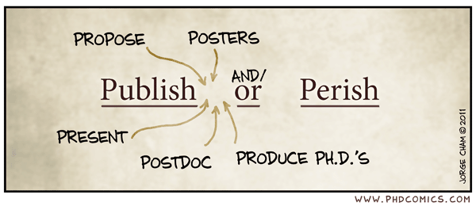
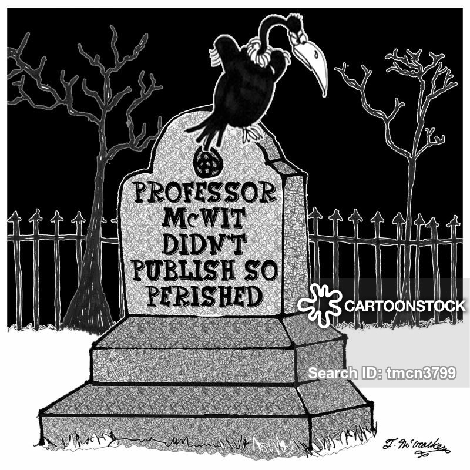

# About

PostDoc in Solid State Physics, exploring a new field. 

Fundamental Science is all interesting and fun, until it is not. Tired of long long long hours in the lab, grown ever more tired of the [publish or perish](https://royalsocietypublishing.org/doi/full/10.1098/rsos.171511)[^1] paradigma[1](#myfootnote1), I found myself wandering about life outside of academia, and found a community which trives on open sources and ideas sharing.

What a refreshing approach to knowledge! And following this goodwilling lead, here I am sharing what I think/hope will be useful, as a reference for future me and possibily for those who also find themeselves fascinated with the rapid growing field of machine learning and artificial intelligence. 
The ambition of this blog is to help bridge the enthusiastic from curious bystander to hands-on practitioner and then maybe even expert, being what I myself hope to accomplish. Stay tuned!

|-|-|
|  |   |

<a name="myfootnote1">1</a>  which sucks all joy from the researcher life and nurtures all kind of *lovely* side effects in direct opposition with the ideal scientific community - such as the discouraging of ideas circulation (lest someone else beats you to it!) or cooperation, while promoting bad behaviors like antagonism or egotism. Ultimately resulting on a slowing down of the overall process of collective learning, a truly frustrating outcome. 
[^1]:  prova
